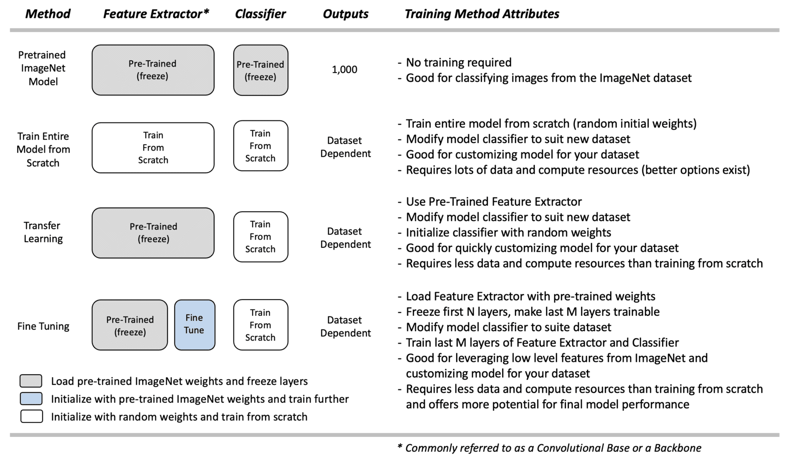

# Image Classification Using Transfer Learning with Torchvision

In this notebook, we will learn how to train an Image Classifier on the Caltech-256 dataset subset provided by using a pretrained model. We will use the ResNet-50 network architecture but we instantiate the convolutional base of the network with weights that have been pre-trained on the ImageNet dataset.

We will add our own classification layer and only train the classifier part of the network. This technique is called transfer learning.

Finally we will demonstrate that using a pre-trained convolutional base results in a tremendous jump in the performance metrics with literally no effort.

## 1. Overview of Pre-Trained Model Use Cases
A typical image classification architecture consists of 4 parts

1. Input image
2. Feature Extractor - a bank of convolutional layers that extract useful features for classification.
3. Classifier - a bank of fully connected layers that classify the image into its output classes.
4. Output vector of class probabilities

the table below,summarizes several use cases.

### 1.1. Pre-Trained ImageNet Models
If you have a need to perform image classification on a wide range of content that encompasses many of the classes in ImageNet, then using a pre-trained model is an excellent choice. As the name implies, no training is required; you can simply load the model and make predictions on your pre-processed input images. There are many pre-trained models available in Torchvision, which you can select from. See our previous post on this topic for more details.

For situations where your application contains specific classes that are not contained in ImageNet we can perform finetuning by unfreezing several conv layers to adapt to new features.

In a previous notebook, we showed how you can use pre-trained ImageNet models to perform classification.

### 1.2. Train from Scratch
If you need to customize a model for a new dataset, one option is to load a model and train it from scratch. When training from scratch, the entire model is initialized with random weights, and training is performed from scratch (with the redefined classifier).

Training a model from scratch requires a lot of data and a lot of computational resources, although this depends on the size of the model. Still, it's a significant factor to consider, especially if you don't have much data and acquiring labeled training data for your application is difficult. 

### 1.3. Transfer Learning
Transfer Learning is a simple approach for re-purposing a pre-trained model to make predictions on a new dataset. The concept is simple. We use the model's pre-trained feature extractor (convolutional base) and re-train a new classifier to learn new weights for the new dataset. This is sometimes referred to as "freezing" the layers in the feature extractor, meaning that we load the pre-trained weights and do not attempt to modify them further during the training process. The theory is that the pre-trained ImageNet Feature Extractor has learned valuable features for detecting many different object types. We assume such features are general enough that we only need to re-train the classifier portion of the network.

This approach requires much less data and computational resources than training from scratch. Remember that training a model often takes many iterations to determine an appropriate set of hyper-parameters for a final model, so the time required to experiment and iterate will be significantly compounded. Since pre-trained models were trained on millions of images, it behooves us to try and leverage that inherent capability. Transfer learning allows you to quickly study how a pre-trained model can be customized for a new dataset. However, sometimes retraining the classifier isn't enough. This is where Fine-Tuning can be very beneficial.

### 1.4. Fine Tuning
Fine-Tuning represents a flexible alternative to Transfer Learning. It is very similar to Transfer Learning. Instead of locking down the feature extractor completely, we load the feature extractor with ImageNet weights and then freeze the first several layers of the feature extractor but allow the last few layers to be trained further. The idea is that the first several layers in the feature extractor represent generic, low-level features (e.g., edges, corners, and arcs) that are fundamental building blocks necessary to support many classification tasks. Subsequent layers in the feature extractor build upon the lower-level features to learn more complex representations that are more closely related to the content of a particular dataset.

With Fine-Tuning, we can specifically leverage the lower-level features of the pre-trained model but provide some flexibility for "fine-tuning" the last few layers of the convolutional base to provide the best possible customization for the dataset. So we "freeze" the initial layers (i.e., make them non-trainable) and let the model train the last few layers of the feature extractor, as well as the classifier. Note that all the layers in the feature extractor are initialized to ImageNet weights. Once training begins, the weights in the last few layers of the feature extractor are updated further, which is why this approach is called Fine-Tuning. Also, the weights in the classifier are initialized to small random values since we want the classifier to learn new weights required to classify new content.