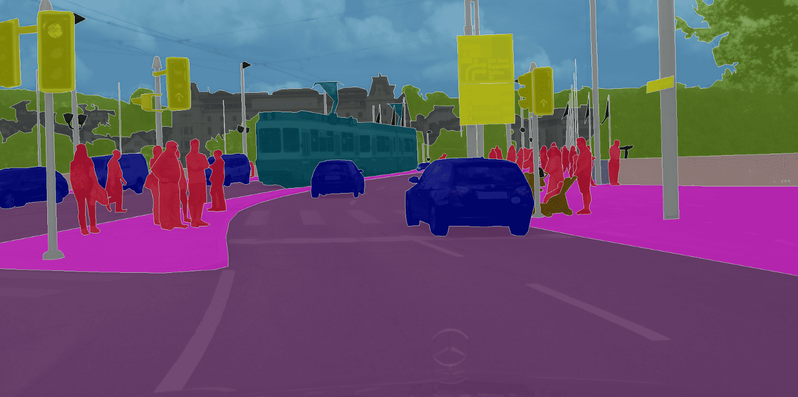

# Introduction to Semantic Segmentation - Day 41

What is Semantic Segmentation?
Semantic Segmentation is an image analysis task in which we classify each pixel in the image into a class.

Similar to what us humans do all the time by default, when are looking then whatever we are seeing if we think of that as an image then we know what class each pixel of the image belongs to.

## Applications of Segmentation
The most common use case for the Semantic Segmentation is in:

1. Autonomous Driving


In autonomous driving, the image which comes in from the camera is semantically segmented, thus each pixel in the image is classified into a class. This helps the computer understand what is present in the its surroundings and thus helps the car act accordingly.

2. Facial Segmentation
Facial Segmentation is used for segmenting each part of the face into a category, like lips, eyes etc. This technique is used for many purposes such as gender estimation, age estimation, facial expression analysis, emotional analysis and more.

3. Indoor Object Segmentation
Guess where is this used? In AR (Augmented Reality) and VR (Virtual Reality). AR applications when required segments the entire indoor area to understand where there are chairs, tables, people, wall, and other obstacles and so on.

4. Geo-Land Sensing
Geo Land Sensing is a way of categorizing each pixel in satellite images into a category such that we can track the land cover of each area. So, say in some area there is a heavy deforestation taking place then appropriate measures can be taken.

---

## Using torchvision for Semantic Segmentation
Now before we get started, we need to know about the inputs and outputs of these semantic segmentation models.
So, let's start!

These models expect a 3-channled image which is normalized with the Imagenet mean and standard deviation, i.e.,
mean = [0.485, 0.456, 0.406], std = [0.229, 0.224, 0.225]

So, the input is [Ni x Ci x Hi x Wi]
where,

Ni -> the batch size
Ci -> the number of channels (which is 3)
Hi -> the height of the image
Wi -> the width of the image
And the output of the model is [No x Co x Ho x Wo]
where,

No -> is the batch size (same as Ni)
Co -> is the number of classes that the dataset have!
Ho -> the height of the image (which is the same as Hi in almost all cases)
Wo -> the width of the image (which is the same as Wi in almost all cases)
Alright! And just one more thing! The torchvision models outputs an OrderedDict and not a torch.Tensor
And in .eval() mode it just has one key out and thus to get the output we need to get the value stored in that key.

The out key of this OrderedDict is the key that holds the output.
So, this out key's value has the shape of [No x Co x Ho x Wo].

## FCN with Resnet-101 backbone
FCN - Fully Convolutional Netowrks, are among the most early invented Neural Networks for the task of Semantic Segmentation.

```python
# Load the FCN ResNet101 segmentation model.
fcn = models.segmentation.fcn_resnet101(
    weights=torchvision.models.segmentation.FCN_ResNet101_Weights.DEFAULT
).eval()
```

## preprocessing and output

for the preprocessing steps, we:

- Resize the image to (256 x 256)
- CenterCrop it to (224 x 224)
- Convert it to Tensor - all the values in the image becomes between [0, 1] from [0, 255]
- Normalize it with the Imagenet specific values mean = [0.485, 0.456, 0.406], std = [0.229, 0.224, 0.225]
- And lastly, we unsqueeze the image so that it becomes [1 x C x H x W] from [C x H x W]
We need a batch dimension while passing it to the models.

As I said, the output of the model is a OrderedDict so, we need to take the out key from that to get the output of the model.
```python
# Pass the input through the net
out = fcn(inp)['out']
print (out.shape)
```

Alright! So, out is the final output of the model. And as we can see, its shape is [1 x 21 x H x W] as discussed earlier. So, the model was trained on 21 classes and thus our output have 21 channels!

Now, what we need to do is make this 21 channeled output into a 2D image or a 1 channeled image, where each pixel of that image corresponds to a class!

So, the 2D image, (of shape [H x W]) will have each pixel corresponding to a class label, and thus
for each (x, y) in this 2D image will correspond to a number between 0 - 20 representing a class.

And how do we get there from this [1 x 21 x H x W]?
We take a max index for each pixel position, which represents the class

```python
import numpy as np
om = torch.argmax(out.squeeze(), dim=0).detach().cpu().numpy()
print (om.shape)
print (np.unique(om))
```
Alright! So, we as we can see now have a 2D image. Where each pixel corresponds to a class! The last thing is to take this 2D image where each pixel corresponds to a class label and convert this
into a segmentation map where each class label is converted into a RGB color and thus helping in easy visualization.

We will use the following function to convert this 2D image to an RGB image wheree each label is mapped to its corresponding color.

```python
# Define the helper function
def decode_segmap(image, nc=21):
    ...
    return rgb
```
Let's see what we are doing inside this function!

first label_colors stores the colors for each of the clases, according to the index
So, the color for the first class which is background is stored in the 0th index of the label_colors list, the second class which is aeroplane is stored at index 1 of label_colors.

Now, we are to create an RGB image from the 2D image passed. So, what we do, is we create empty 2D matrices for all 3 channels.

So, r, g, and b are arrays which will form the RGB channels for the final image. And each are of shape [H x W] (which is same as the shape of image passed in)

Now, we loop over each class color we stored in label_colors. And we get the indexes in the image where that particular class label is present. (idx = image == l) And then for each channel, we put its corresponding color to those pixels where that class label is present.

And finally we stack the 3 seperate channels to form a RGB image.

Okay! Now, let's use this function to see the final segmented output
`rgb = decode_segmap(om)`
the output is the segmented image.