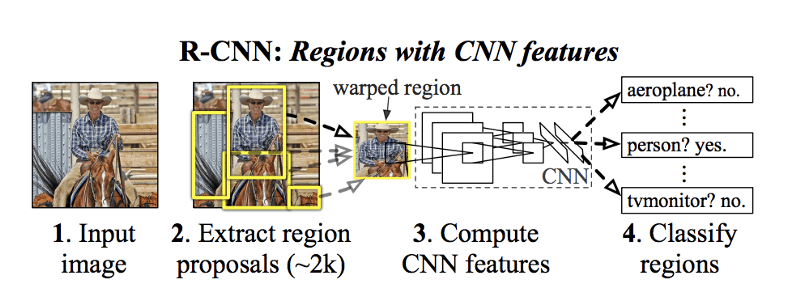
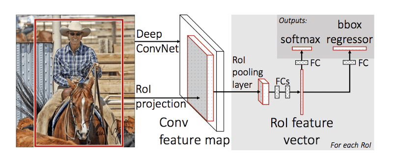

# Object Detection with Pytorch - Day 42

## Object Detection
In image classification, we assign a single label (e.g. cat, dog, etc.) to the entire image. This is adequate for many tasks where the location of the object you are interested in is not important.

On the other hand, there can be multiple objects in the image, and the application may demand not just identifying the objects, but also locating them in the image.

For such tasks we need Object Detection. In this category of techniques, the input to the model is an image, and the output is an array of bounding boxes, and a class label for every bounding box.

The main challenge here is that there might be a varying number of objects in every input image.

Conceptually, Object Detection sits in between Image Classification and Image Segmentation (every pixel is assigned a class label).

Classification is blazingly fast but the output is just a single class label for the entire image.

Segmentation provides a detailed output - a class label for every pixel - but is slow.

Object Detection, serves as a happy compromise - fast, and with enough localization accuracy for many tasks.

## Sliding Window Approach
Sliding window is one of the oldest approach in object detection where the input image is split into multiple crops and each crop of the image is classified and if the crop contains a class, then the crop is decided as the bounding box. But this approach is never used in practice as each input image may have 1000s of such crops and each crop passing through the network for classification may take time.

## Region Proposal (RCNN)
Image processing techniques are used to make list of proposed regions in the input image which are then sent through the network for classification. But this is computationally more efficient than sliding window approach as only fewer potential crops which may contain the object is classified by the network.

RCNN is better than sliding window, but its still computationally expensive as the network has to classify all the region proposals. It takes around 30-40s for inference of a single image.

## Fast Region Proposal (Fast RCNN)
In fast RCNN, rather than getting region proposals and classifying each region proposals, the input image is sent into the CNN network which gives a feature map of the image. Again some region proposals are used but now we get the region proposals from the feature map of the image and these feature maps are classified. This reduces the computation as some of the CNN layers are common for the whole image.

## Faster R-CNN
The idea of Faster R-CNN is to use CNNs to propose potential region of interest and the network is called Region Proposal Network. After getting the region proposals , its just like Fast RCNN, we use every regions for classification.

### Comparison - RCNN, Fast RCNN & Faster RCNN

| Feature                  | RCNN                                    | Fast RCNN                         | Faster RCNN                        |
|--------------------------|----------------------------------------|-----------------------------------|-------------------------------------|
| **Year**                 | 2014                                   | 2015                              | 2015                                |
| **Region Proposal Method** | Selective Search                      | Selective Search                  | Region Proposal Network (RPN)      |
| **CNN Processing**       | Separate CNN per region (~2,000 times) | Single CNN for entire image       | Single CNN for entire image        |
| **Speed**               | Very slow (40-50 sec/image)            | Faster (~2 sec/image)             | Fastest (~0.2 sec/image)           |
| **Accuracy**            | Good                                   | Better                            | Best                               |
| **End-to-End Trainable?** | No                                     | Yes                               | Yes                                |
| **Main Drawback**       | Too slow                               | Still uses Selective Search       | High computation for large images  |

## Object Detection with PyTorch
The pretrained Faster-RCNN ResNet-50 model we are going to use expects the input image tensor to be in the form [n, c, h, w] where

n is the number of images
c is the number of channels , for RGB images its 3
h is the height of the image
w is the widht of the image
The model will return

Bounding boxes [x0, y0, x1, y1] all all predicted classes of shape (N,4) where N is the number of classes predicted by the model to be present in the image.
Labels of all predicted classes.
Scores of each predicted label.
