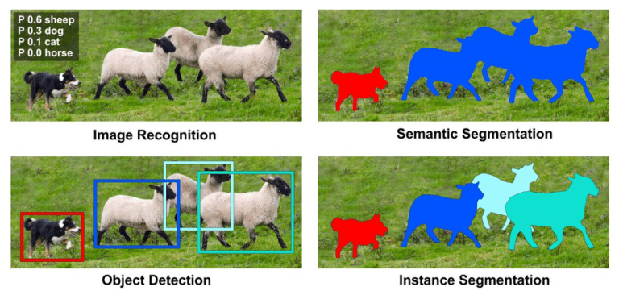

# DAY 43 - Instance Segmentation with Mask Region Based CNN

## What is an Instance Segmentation?

Instance Segmentation is a combination of 2 problems
- Object Detection
- Semantic Segmentation
Instance Segmentation involves classifying each pixel or voxel of a given image or volume to a particular class and assigning a unique identity to the pixels of individual objects. Semantic Segmentation, on the other hand, also classifies each pixel of an image to a particular class, but it does not differentiate between individual objects of the same class. All pixels belonging to a single class are assigned the same label, without distinguishing between different objects.

This makes Instance Segmentation suitable for applications where the outline of objects, their spatial distribution matter, and individual identities. So meticulously, Instance segmentation is a combination of object detection (class-wise localization) and segmentation (pixel-wise classification).

A kind of network called Mask RCNN is the state of the art in Instance Segmentation. Mask RCNN uses 2 type of networks one like Faster RCNN for Object Detection and another fully convolutional network for Semantic Segmentation. The first model will get the bounding box and classify it and the second model is used on each of the region of interest for semantic segmentation.

In brief, Faster RCNN consists of two stages. The first stage, called a Region Proposal Network (RPN), proposes candidate object bounding boxes. The second stage, which is in essence Fast R-CNN, extracts features using RoIPool from each candidate box and performs classification and bounding-box regression. Mask R-CNN adopts the same two-stage procedure, with an identical first stage (which is RPN). In the second stage, in parallel to predicting the class and box offset, Mask R-CNN also outputs a binary mask for each RoI.

##  Instance Segmentation with Torchvision Models

All the pretrained models in pytorch can be found in [torchvision.models](https://pytorch.org/docs/stable/torchvision/models.html)

The input to the model is expected to be a list of tensors, each of shape **[C, H, W]**, one for each image, and should be in 0-1 range. Different images can have different sizes.

During inference, the model requires only the input tensors, and returns the post-processed predictions as a **List[Dict[Tensor]]**, one for each input image. The fields of the Dict are as follows:

- `boxes (Tensor [N, 4]`): the predicted boxes in **[x0, y0, x1, y1]** format, with values between 0 and H and 0 and W.

- `labels (Tensor[N]`): the predicted labels for each image.

-  `scores  (Tensor[N]`): the scores or each prediction.

-  `masks  (Tensor[N, H, W]`): the predicted masks for each instance, in 0-1 range. In order to obtain the final segmentation masks, the soft masks can be thresholded, generally with a value of 0.5 (mask >= 0.5).

### Utilities
Let's create some helper functions.   
We will create the `random_color_masks()` function to fill the predicted-mask with colors, `get_predictions()` to return the final predictions from the model and finally the `instance_segmentation_api()` to overlay the colored mask over the original image and plot it.

### Running inference on the image
```python
transform = T.Compose([T.ToTensor()])
img_tensor = transform(img)
with torch.no_grad():
    pred = model([img_tensor])
```

## Application: Background blurring

Here we will use the segmentation algorithm to blur the background. The whole concept is broken down into few steps.  
1. Pick the class we want to keep as foreground (person) and get its mask using the segmentation api. The locations belonging to person-class will be labelled as 1 and the rest as 0.
2. Blur the original image.
3. Create a new image such that, pixel locations where the mask is 1 is replaced with the original values and the rest with the blurred values.

## Conclusion
Instance Segmentation is challenging because it requires the correct detection of all objects in an image while also precisely segmenting each instance. It therefore combines elements from the classical computer vision tasks of object detection, where the goal is to classify individual objects and localize each using a bounding box, and semantic segmentation, where the goal is to classify each pixel into a fixed set of categories without differentiating object instances.

One of the significant challenges in instance segmentation is dealing with occlusions, especially when objects of the same class overlap. Despite this, our Mask R-CNN model performed exceptionally well across all instances.

