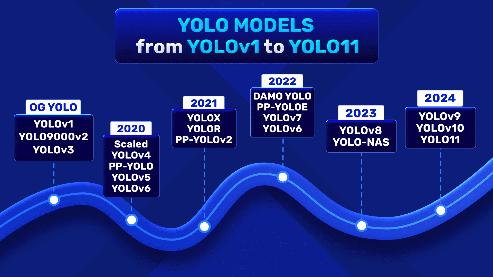
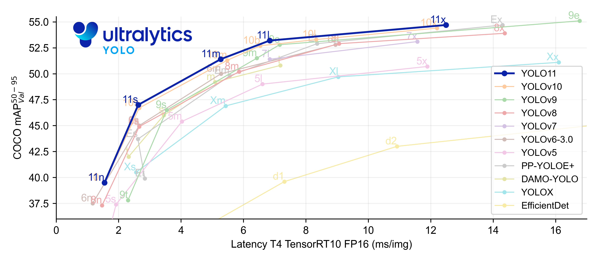

# YOLO11 (You Only Look Once) - DAY 44

**YOLO** (You Only Look Once) is a popular object detection model known for its speed and accuracy. It performs real-time object detection by processing the entire image in a single pass, making it highly efficient for various applications.

## **YOLO11**

YOLO11 is a SOTA Object Detection model improving upon its predecessors. Its extra-large model achieves an highest **COCO mAP50:95** of **54.7**.
### **YOLO11 Family of Models:**

| Model   | Size (pixels) | mAPval 50-95 | Speed CPU ONNX (ms) | Speed T4 TensorRT10 (ms) | Params (M) | FLOPs (B) |
|---------|--------------|--------------|----------------------|--------------------------|------------|-----------|
| YOLO11n | 640          | 39.5         | 56.1 ± 0.8           | 1.5 ± 0.0                | 2.6        | 6.5       |
| YOLO11s | 640          | 47.0         | 90.0 ± 1.2           | 2.5 ± 0.0                | 9.4        | 21.5      |
| YOLO11m | 640          | 51.5         | 183.2 ± 2.0          | 4.7 ± 0.1                | 20.1       | 68.0      |
| YOLO11l | 640          | 53.4         | 238.6 ± 1.4          | 6.2 ± 0.1                | 25.3       | 86.9      |
| YOLO11x | 640          | 54.7         | 462.8 ± 6.7          | 11.3 ± 0.2               | 56.9       | 194.9     |

### **YOLO11 vs Other Object Detectors:**

### **Key Features:**

- **Highly Adaptable**: The YOLO11 family contains models of different sizes that are appropriate for different applications. Small models can be used on the edge, while larger models can run on the servers for better accuracy.

- **Multiple Supported Tasks**: Object detection, instance segmentation, classification, pose estimation, oriented object detection.

### **Resources:**
**Github**: [YOLO11 Repository](https://github.com/ultralytics/ultralytics)

**Blogpost**: [YOLO11 on LearnOpenCV](https://learnopencv.com/yolo11/)

**Ultralytics**: [Ultralytics](https://ultralytics.com) is a platform built upon PyTorch, hosting various models like **YOLOv5**, **YOLOv8**, **YOLOv9**, **YOLOv10**, **YOLO11**, **SAM** and **RW-DETR** and simplifies the process of training, inference and deployment.  

