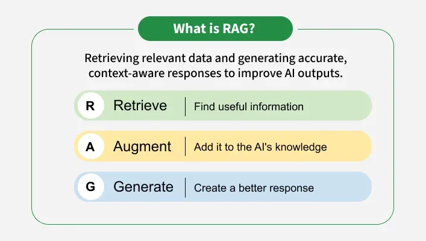
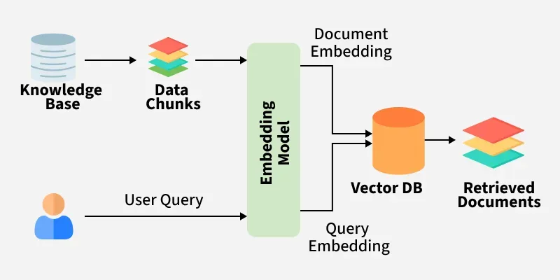

# Day 48: Understanding Retrieval-Augmented Generation (RAG)

##  What is RAG?

**Retrieval-Augmented Generation (RAG)** is a method that combines a **retriever** and a **generator** to enhance the performance of a language model by allowing it to fetch external knowledge during inference. This is especially helpful for answering questions based on data that the model wasn't trained on.

---

##  Why RAG?

Traditional LLMs like GPT or BERT are **static** — they can only answer based on the data they were trained on. RAG extends their ability to:

* Access **updated** or **domain-specific knowledge**.
* Reduce the need for costly **fine-tuning**.
* Improve **accuracy** by grounding responses in real documents.

---

##  Relation Between RAG and LLMs

RAG is built **on top of LLMs**. Instead of replacing the model, it **augments** it:

* The **retriever** fetches relevant documents.
* The **generator** (LLM like T5, BART, or GPT) uses those documents to generate an answer.

This combination allows LLMs to access **real-time**, **external** knowledge, making them more versatile and accurate.

---

##  How RAG works?
The system first searches external sources for relevant information based on the user’s query Instead of relying only on existing training data.

1. Creating External Data

External data refers to new information beyond the LLM’s original training dataset. It can come from various sources, such as APIs, databases, or document repositories, and may exist in different formats like text files or structured records. To make this data understandable to AI, it is first divided in chunks in case of massive datasets and converted into numerical representations (embeddings) using specialized models and then stored in a vector database. This creates a knowledge library that the AI system can reference during retrieval.

2. Retrieving Relevant Information

When a user submits a query, the system converts it into a vector representation and matches it against stored vectors in the database. This enables precise retrieval of the most relevant information. For example, if the Y.O.G.I Botis asked, "What are the key topics in the DSA course?", it would retrieve both the course syllabus and relevant study materials. This ensures the response is highly relevant and tailored to the user's learning needs.

3. Augmenting the LLM Prompt

Once the relevant data is retrieved, it is incorporated into the user’s input (prompt) using prompt engineering techniques. This enhances the model’s contextual understanding, allowing it to generate more detailed, factually accurate, and insightful responses.

4. Keeping External Data Updated

To ensure the system continues to provide reliable and up-to-date responses, external data must be refreshed periodically. This can be done through automated real-time updates or scheduled batch processing. Keeping vector embeddings updated allows the RAG system to always retrieve the most current and relevant information for generating responses.

---

##  Components of RAG

| Component | Description                             | Examples                        |
| --------- | --------------------------------------- | ------------------------------- |
| Retriever | Finds relevant documents for the query  | DPR, BM25, SentenceTransformers |
| Vector DB | Stores and searches document embeddings | FAISS, Chroma, Weaviate         |
| Generator | Generates response using query + docs   | T5, BART, GPT, LLaMA            |

---

##  RAG vs Fine-Tuning

| Feature       | Fine-Tuning                         | RAG                                      |
| ------------- | ----------------------------------- | ---------------------------------------- |
| Update Method | Requires retraining                 | Update external knowledge base           |
| Cost          | Expensive (training time + compute) | Lightweight, runs at inference time      |
| Flexibility   | Task-specific                       | General, scalable, modular               |
| Performance   | Good with lots of labeled data      | Strong in low-data or open-domain setups |

---

##  Real-World Applications

* **Customer Support** → Combine chatbot + internal docs
* **Healthcare Q\&A** → Use RAG on clinical papers
* **Legal Tech** → Extract legal info from statutes
* **Academic Research Assistants** → Search + summarize papers
* **E-commerce** → Product-based Q\&A from catalogs

---

## Example: How RAG Works

**Question:** Who founded Facebook?

**Retriever:** Fetches a Wikipedia doc with: "Facebook was founded by Mark Zuckerberg in 2004..."

**Generator:** Forms: "Facebook was founded by Mark Zuckerberg."

---

##  Summary

* RAG = Retriever + Generator (LLM)
* It bridges the gap between static LLMs and dynamic knowledge.
* No need to retrain your model for new data — just update your knowledge base.

---

 ### What are the available options for customizing a Large Language Model (LLM) with data, and which method—prompt engineering, RAG, fine-tuning, or pretraining—is considered the most effective?

When customizing a Large Language Model (LLM) with data, several options are available, each with its own advantages and use cases. The best method depends on your specific requirements and constraints.

The best method depends on your specific requirements:

- Use Prompt Engineering if you need a quick and simple solution for specific tasks or queries.
- Use RAG if you need to enhance your model's responses with real-time, relevant information from external sources.
- Use Fine-tuning if you have domain-specific data and want to improve the model's performance on specific tasks.
- Use Pretraining if you need a strong foundation for further customization and adaptation.

---